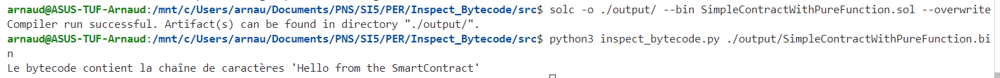
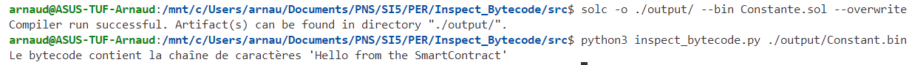
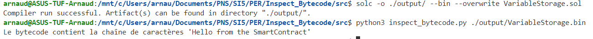
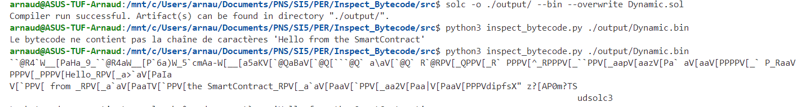
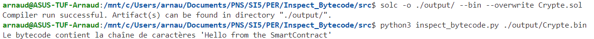
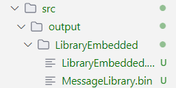
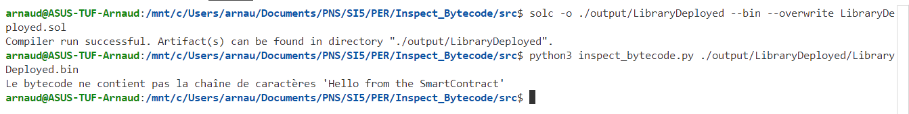
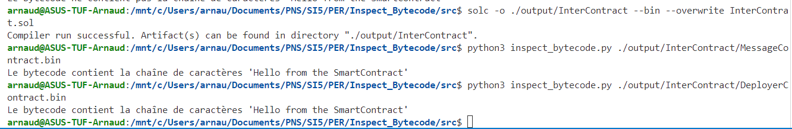

# Compte rendu du 22/11/2024 

Ici nous avons inspecter plusieurs cas possible :

- Contrat simple avec une fonction pure qui retourne la chaine de caractere  

La chaine est bien présente dans le bytecode, car elle fait partie des données statiques

- Chaine définis avec une constante 

La chaine est bien présente dans le bytecode, car les constantes sont intégrées directement intégré dans le bytecode

- Chaine définis avec une variable d'état 

La chaine est bien présente dans le bytecode, car les variables d'état sont stockées dans le storage.
Ma théorie est que Solidity doit generer un getter pour chaque variable d'état, et que le bytecode de la fonction doit contenir le code pour appeler ce getter.

- Contrat simple qui construit dynamiquement la chaine de caractere dans une fonction

Ici c'est un cas particulier, notre vérificateur python fait simplement une vérification de la présence de la chaine de caractere "Hello from the SmartContract" cependant dans ce cas la chaine de caractere est construite dynamiquement dans la fonction, ainsi, on peut retrouver cette chaine mais éclaté dans différentes partie du bytecode. Si on regarde bien on arrive a retrouver chaque bout de la phrase.

En modifiant legerement le script python pour afficher le binaire en gardant uniquement les caractere ASCII on voit qu'on arrive a retrouver des les éléments qui constitue notre phrase

- Chaine encrypté ou encodé

Nous utilisons la fonction `abi.encodePacked` pour encoder la chaine de caractere, cette fonction permet de concatener les valeurs passées en paramètre et de les encoder en hexadécimal. On peut voir que la chaine de caractere est bien présente dans le bytecode, et facilement retrouvable car dans tout les cas la chaine sera encodé en hexadécimal dans le bytecode, la seule différence est l'espace mémoire utilisé.

Donc on arrive a retrouvé la valeur

- library pour manipuler les chaines de caractere

Nous allons utiliser les **library** pour manipuler les chaines de caractere, une library est une sorte de contrat qui contient du code réutilisable, cependant elle ne peuvent pas déclarer de variables d'état, ni de fonctions payable. Une library est inclus dans un le contrat si toute les fonctions sont déclaré **internal** sinon elle doivent etre déployé et ensuite lié avant que le contrat soit déployé.

Dans le cas des library incluse, la compilation de cette derniere produit 2 binaire, un pour la libairie et un autre pour la librairie incluse dans le contrat.

Néanmoins on remarque qu'ici que l'on retrouve dans le bytecode du contrat la chaine de caractere puisqu'elle a été incluse dans le bytecode du contrat. Ce qui pose a se demandé pourquoi generer le bytecode de la Librairie ?

Dans le cas des library déployé, la compilation de cette derniere également 2 binaire, un pour la libairie et un autre pour le contrat qui utilise la librairie. On peut voir que la chaine de caractere est bien présente dans le bytecode de la librairie mais qu'elle n'est plus dans le bytecode du contrat.

- Appel Inter-contrats avec déploiement dynamique  

Si le contrat principal déploie un autre contrat à la volée et interagit avec lui, la chaîne sera dans le bytecode du contrat déployé.
Et on retrouve la phrase dans les 2 

- Utilisation d'un constructeur pour initialiser la chaine de caractere

- Heritage simple avec une fonction héritée  
- Rédéfinitions de fonction héritée
- Appel à une fonction d'un contrat parent avec super
- Appel d'un autre contrat via adresse
- Utilisation d'une interfaces avec une constante
- Heritage multiple
- Contrat abstrait 
- Heritage multiple et contrat abstrait

